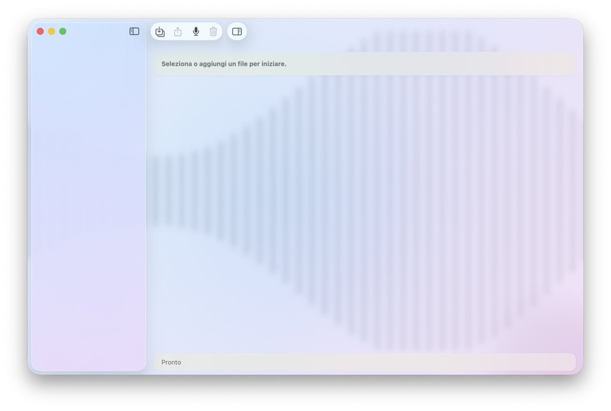
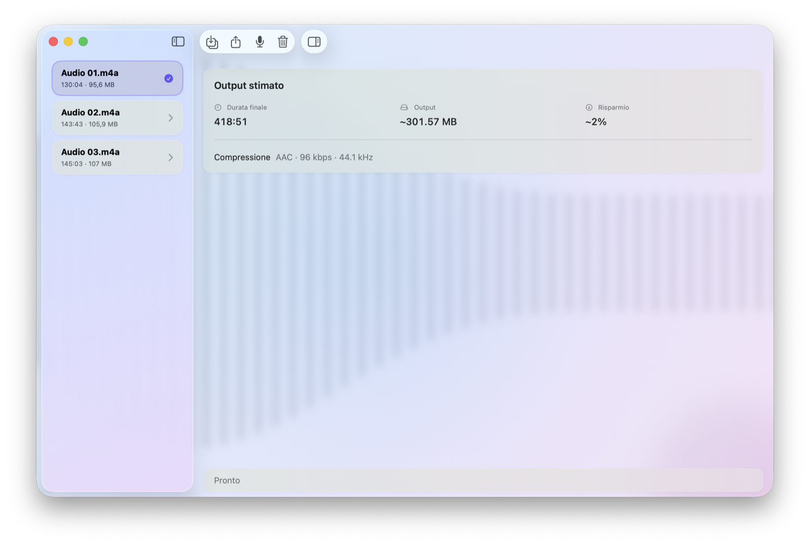
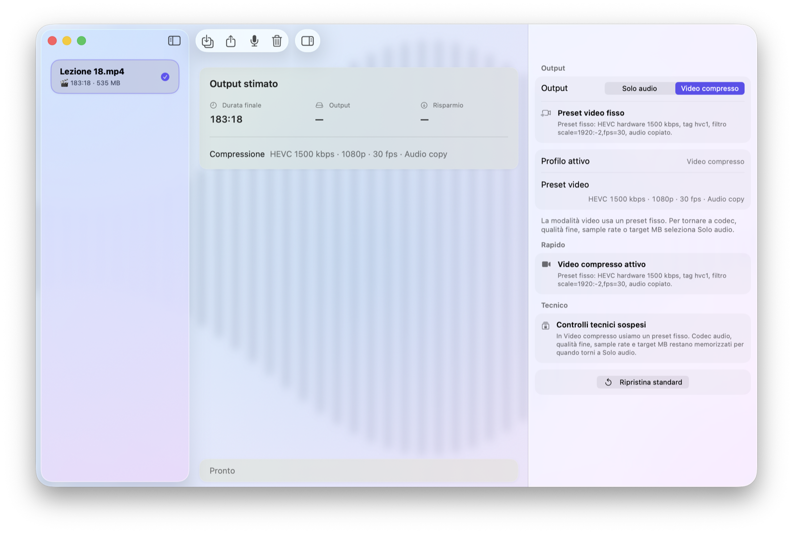
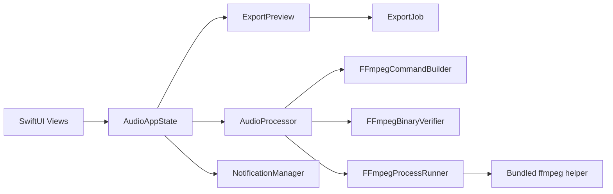

# AudioPro

[](https://github.com/CometaSensitiva/AudioPro/actions/workflows/ci.yml)

[](LICENSE)

AudioPro is a Tahoe-style macOS app for importing audio or video files, previewing export settings, and producing either optimized audio output or a compressed video export preset for lecture recordings.

The app keeps its current visual language through a compatibility design layer while targeting `macOS 14+`.

## Highlights

- Import audio and video files through the native macOS workflow.
- Export audio-only output from audio or video sources.
- Merge multiple audio files into a single export.
- Use a dedicated compressed video preset for single lecture recordings.
- Bundle `ffmpeg` helpers with build-time hash verification and runtime signature checks.

## Screenshots

### Empty state



### Multi-file audio export



### Video compressed mode



## Download and install

GitHub Releases are the supported distribution channel for end users.

1. Download the latest `AudioPro-<version>-macOS.zip` asset from the Releases page.
2. Unzip the archive and move `AudioPro.app` to `/Applications`.
3. On first launch, use `right click > Open` on the app.
4. If macOS still blocks the app, open `System Settings > Privacy & Security` and allow it manually.

The app is currently distributed without notarization, so first launch requires the standard Gatekeeper override flow for non-notarized apps.

## Architecture

The technical architecture is documented in [docs/architecture.md](docs/architecture.md).



## Project structure

- `AudioPro/`: app source files
- `AudioProTests/`: test target
- `AudioPro.xcodeproj/`: Xcode project
- `docs/`: technical documentation and screenshots
- `scripts/`: local release utilities

## Development

Open `AudioPro.xcodeproj` in Xcode and run the `AudioPro` scheme.

Minimum supported OS: `macOS 14.0`.

## GitHub Releases

Official release archives are built locally on macOS and then uploaded manually to GitHub Releases.

To produce a release archive locally:

```bash
./scripts/build-release.sh
```

The script builds the `Release` configuration, verifies the packaged `ffmpeg` helpers, creates a versioned ZIP archive, and writes `SHA256SUMS.txt`.

CI is used only for validation and does not publish end-user artifacts.

## Changelog

Project history is tracked in [CHANGELOG.md](CHANGELOG.md).

## Bundled FFmpeg

The app ships with two vendored `ffmpeg` helpers inside `AudioPro/`:

- `ffmpeg-binary-arm64`
- `ffmpeg-binary-x86_64`

The Xcode build phase verifies the SHA-256 of both source binaries before copying them into `AudioPro.app/Contents/Helpers/`.
At runtime the app launches the packaged helper only if it is executable and its code signature is valid.

Expected source SHA-256:

- `ffmpeg-binary-arm64`: `3b586ff896c0339e8fd574c143aaccac23c80789341e22d4202f8013a133d3a4`
- `ffmpeg-binary-x86_64`: `26b3ff92f64950f16be16eed88fe29064c2df516efdfac66cb8fa9abed030bdf`

## License

AudioPro source code in this repository is licensed under the [MIT License](LICENSE).

Bundled third-party tools such as `ffmpeg` remain subject to their own licenses.
