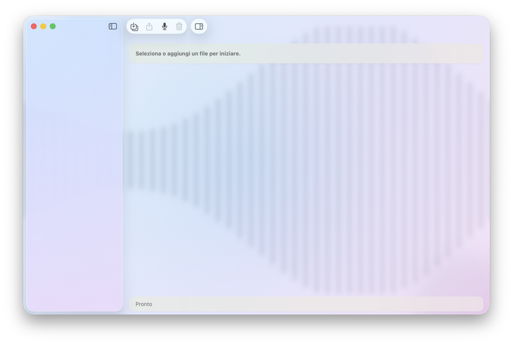
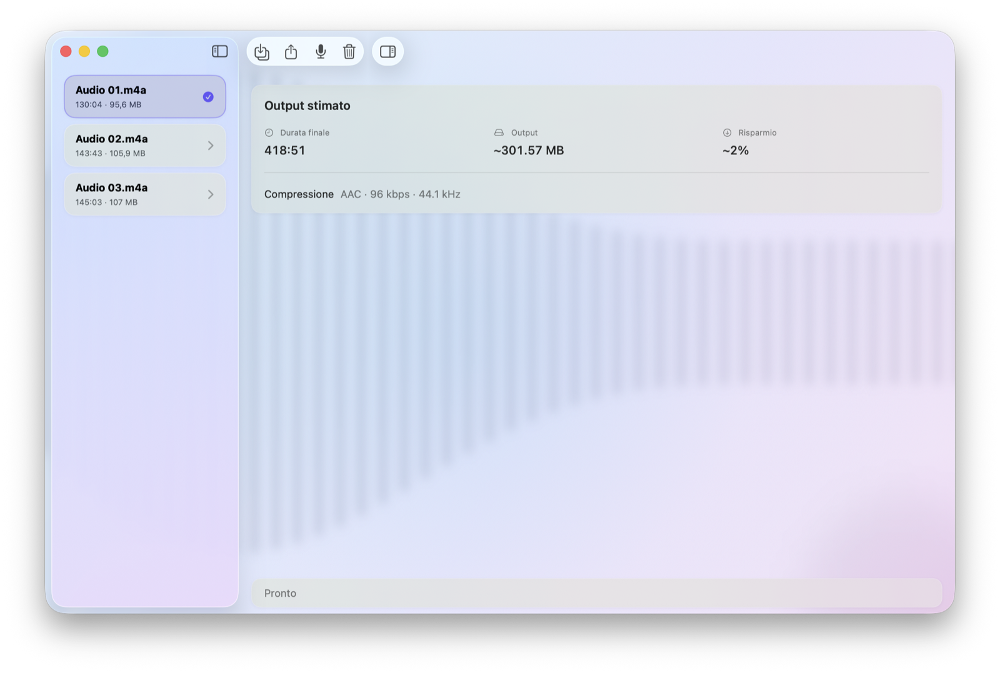
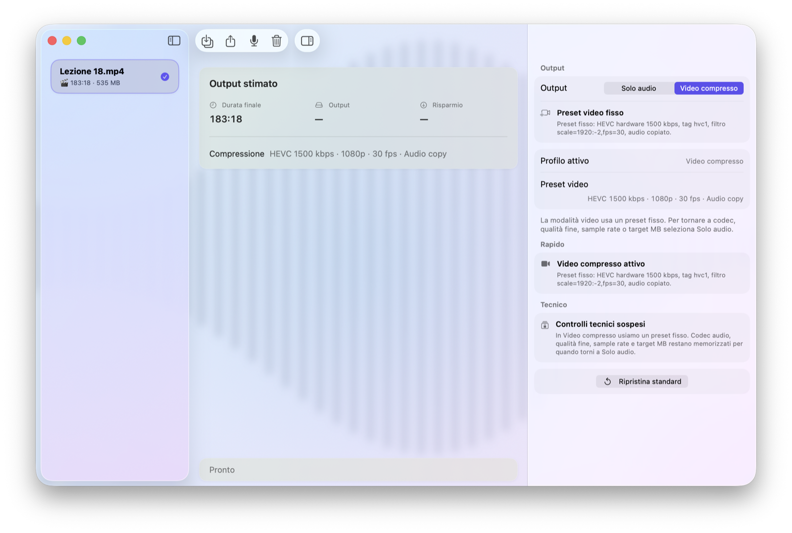
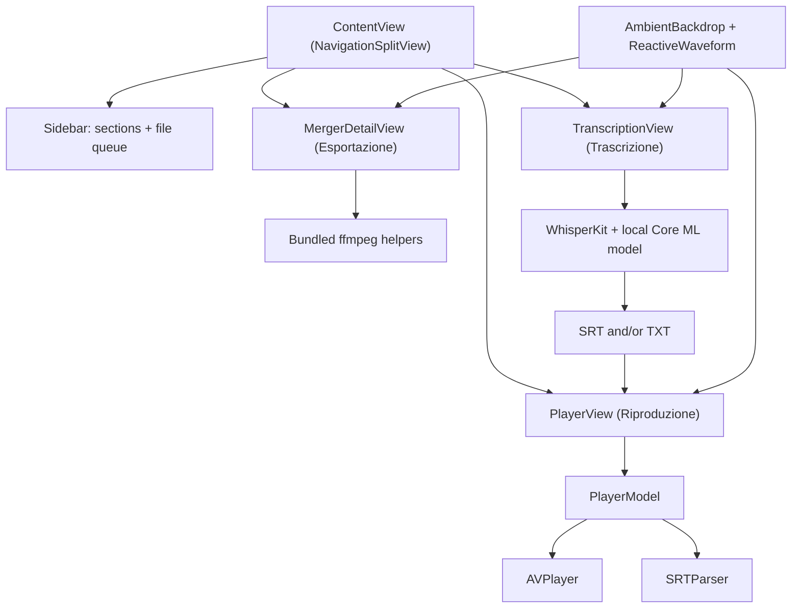

# AudioPro

[](https://github.com/CometaSensitiva/AudioPro/actions/workflows/ci.yml)

[](LICENSE)

AudioPro is a single Liquid Glass macOS study app with three sidebar sections:

- **Esportazione** imports audio or video files and produces optimized audio output or a compressed video export preset.
- **Trascrizione** runs the bundled WhisperKit/Core ML model locally and creates `.srt`, `.txt`, or both.
- **Riproduzione** plays audio or video alongside an SRT transcript with synchronized highlighting and click-to-seek navigation.

Playback and transcription keep running while you move between sections. The UI follows Apple's Liquid Glass guidance: a static ambient backdrop, glass only on the functional layer, and a waveform that animates only during active work.

## Highlights

- Import audio and video files through the native macOS workflow.
- Export audio-only output from audio or video sources.
- Merge multiple audio files into a single export.
- Use a dedicated compressed video preset for single lecture recordings.
- Bundle `ffmpeg` helpers with build-time hash verification and runtime signature checks.
- Transcribe one lecture at a time with real progress, safe cancellation, selectable output, and transactional file writing.
- Load SRT transcripts independently from media files in the Riproduzione section.
- Hand an export to Trascrizione and a completed transcript to Riproduzione with explicit actions.
- Follow the active subtitle cue with automatic scrolling and click any cue to seek.
- Zero idle CPU: the background waveform animates only while audio plays or an export runs, and respects Reduce Motion.

## Screenshots

### Empty state



### Multi-file audio export



### Video compressed mode



## Download and install

GitHub Releases are the supported distribution channel for end users.

1. Download the latest `AudioPro-<version>-macOS.zip` asset from the Releases page.
2. Unzip the archive and move `AudioPro.app` to `/Applications`.
3. On first launch, use `right click > Open` on the app.
4. If macOS still blocks the app, open `System Settings > Privacy & Security` and allow it manually.

The app is currently distributed without notarization, so first launch requires the standard Gatekeeper override flow for non-notarized apps.

## Architecture

The technical architecture is documented in [docs/architecture.md](docs/architecture.md).


```mermaid
flowchart TD
    CV["ContentView (NavigationSplitView)"] --> Sidebar["Sidebar: sections + file queue"]
    CV --> Merger["MergerDetailView (Esportazione)"]
    CV --> Transcription["TranscriptionView (Trascrizione)"]
    CV --> Player["PlayerView (Riproduzione)"]
    Merger --> FFmpeg["Bundled ffmpeg helpers"]
    Transcription --> Whisper["WhisperKit + local Core ML model"]
    Whisper --> Outputs["SRT and/or TXT"]
    Outputs --> Player
    Player --> PM["PlayerModel"]
    PM --> AVPlayer["AVPlayer"]
    PM --> SRT["SRTParser"]
    Backdrop["AmbientBackdrop + ReactiveWaveform"] --> Merger
    Backdrop --> Transcription
    Backdrop --> Player
```

## Project structure

- `AudioPro/Transcription/`: local Whisper workflow, progress, cancellation, output transaction, and UI
- `AudioPro/Player/`: Riproduzione section, AVPlayer, SRT parser, and synchronized transcript UI
- `AudioProTests/`: test target (includes the SRT parser logic tests)
- `AudioPro.xcodeproj/`: Xcode project
- `docs/`: technical documentation and screenshots
- `experiments/`: retained prototypes and visual experiments
- `scripts/`: local release utilities

## Development

Open `AudioPro.xcodeproj` in Xcode and use the shared `AudioPro` scheme.

Minimum supported OS: `macOS 26.0`.

WhisperKit is resolved from the official `argmaxinc/argmax-oss-swift` repository, pinned exactly to `1.0.0` in the tracked `Package.resolved`.

### Local Whisper model for personal builds

AudioPro supports an optional personal model folder outside the repository and iCloud:

```text
~/Library/Application Support/AudioPro/LocalModels/
├── openai_whisper-large-v3-v20240930/
└── whisper-large-v3-tokenizer/
```

Normal personal builds use `INCLUDE_LOCAL_WHISPER_MODEL=YES`. If the folder exists, the Xcode build phase copies it into:

```text
AudioPro.app/Contents/Resources/WhisperModels/
```

If it is missing, or if `INCLUDE_LOCAL_WHISPER_MODEL=NO` is passed to `xcodebuild`, the build still succeeds and the app reports that local transcription is unavailable.


```mermaid
flowchart LR
    LM["Application Support/AudioPro/LocalModels"] --> Build["Xcode build"]
    Build --> Bundle["AudioPro.app Resources/WhisperModels"]
    Bundle --> Transcribe["Local transcription"]
    Transcribe --> Files["Selected SRT/TXT output"]
    Files --> Player["Synchronized player transcript"]
```

## GitHub Releases

Official release archives are built locally on macOS and then uploaded manually to GitHub Releases.

To produce a release archive locally:

```bash
./scripts/build-release.sh
```

The script builds the `Release` configuration with `INCLUDE_LOCAL_WHISPER_MODEL=NO`, verifies that neither the app nor the ZIP contains `WhisperModels`, verifies the packaged `ffmpeg` helpers, creates a versioned ZIP archive, and writes `SHA256SUMS.txt`.

Public GitHub releases therefore support Esportazione and Riproduzione but do not contain the personal 1.5 GB Whisper model. The repository contains only the WhisperKit source dependency and its required third-party notices.

CI builds and tests the application but does not publish end-user artifacts.

## Changelog

Project history is tracked in [CHANGELOG.md](CHANGELOG.md).

## Bundled FFmpeg

The app ships with two vendored `ffmpeg` helpers inside `AudioPro/`:

- `ffmpeg-binary-arm64`
- `ffmpeg-binary-x86_64`

The Xcode build phase verifies the SHA-256 of both source binaries before copying them into `AudioPro.app/Contents/Helpers/`.
At runtime the app launches the packaged helper only if it is executable and its code signature is valid.

Expected source SHA-256:

- `ffmpeg-binary-arm64`: `3b586ff896c0339e8fd574c143aaccac23c80789341e22d4202f8013a133d3a4`
- `ffmpeg-binary-x86_64`: `26b3ff92f64950f16be16eed88fe29064c2df516efdfac66cb8fa9abed030bdf`

## License

AudioPro source code in this repository is licensed under the [MIT License](LICENSE).

Bundled third-party tools such as `ffmpeg` remain subject to their own licenses. WhisperKit notices are included in `AudioPro/Resources/ThirdPartyNotices/` and copied into the app bundle.
