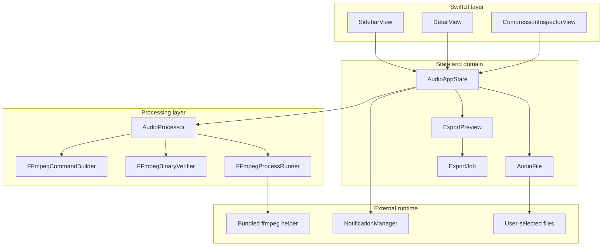
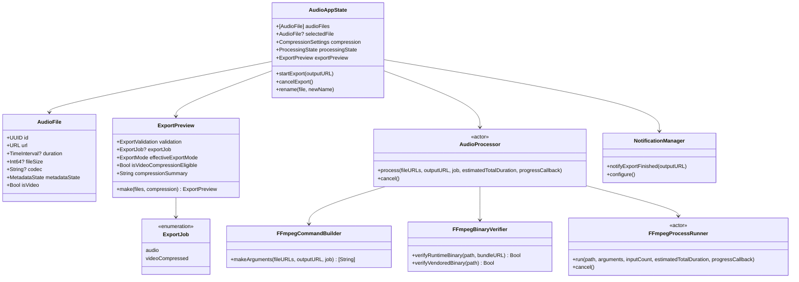
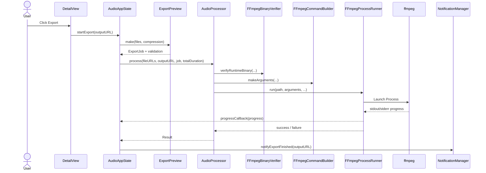
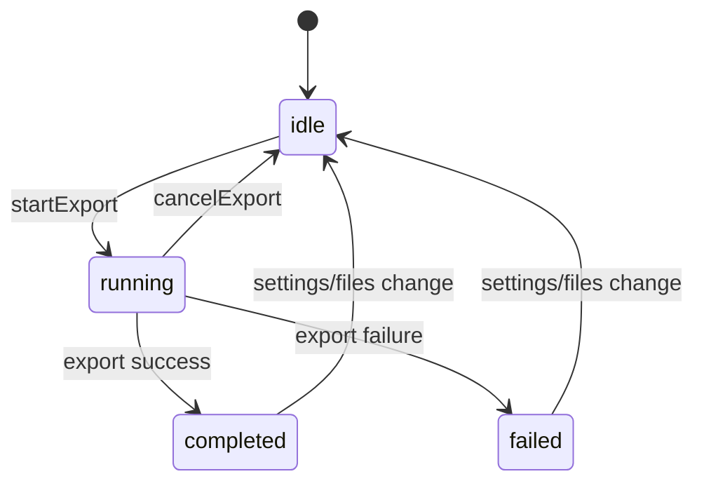

# AudioPro Architecture

AudioPro is a sandboxed macOS app built around a small set of focused layers:

- SwiftUI views render the Tahoe-style interface and route user actions.
- `AudioAppState` owns UI state, file selection, export orchestration, and progress propagation.
- `ExportPreview` derives export feasibility and the final `ExportJob`.
- `AudioProcessor` orchestrates ffmpeg resolution, command building, helper verification, and process execution.
- A bundled `ffmpeg` helper performs the actual media transformation.

## High-level component map

## Simplified UML / type relationships

## Export sequence

## Processing state machine

## Sandbox and file access notes

- The app runs with App Sandbox enabled.
- The main app entitlement grants `com.apple.security.files.user-selected.read-write`.
- Imported files can be security-scoped; `AudioFile` currently keeps that capability alive for the lifetime of the model object.
- The bundled `ffmpeg` helper inherits the sandbox and is packaged inside `AudioPro.app/Contents/Helpers/`.

## Export pipeline details

- `AudioFile` loads metadata asynchronously with AVFoundation and exposes duration, size, codec, and `isVideo`.
- `ExportPreview` is the decision layer:
  - validates the current selection,
  - computes bitrate and size estimates for audio exports,
  - resolves the effective export mode,
  - emits an `ExportJob`.
- `AudioProcessor` does not decide *what* to export; it executes a precomputed `ExportJob`.
- `FFmpegCommandBuilder` keeps argument generation deterministic and separately testable.
- `FFmpegProcessRunner` owns `Process`, progress parsing, cancellation, and bounded stderr/stdout retention through `ProcessLogTail`.

## ffmpeg helper trust model

- Two vendored helpers are stored in the repository:
  - `ffmpeg-binary-arm64`
  - `ffmpeg-binary-x86_64`
- The Xcode build phase verifies their SHA-256 values before copying them into the app bundle.
- Runtime verification accepts:
  - vendored source binaries only if the SHA-256 matches;
  - packaged helpers only if the code signature is valid.
- This is sufficient for a GitHub-distributed personal project, but it is not a substitute for notarization or a full release-signing pipeline.

## Local release pipeline

## Distribution constraints

- Releases are built locally on macOS, then uploaded manually to GitHub Releases.
- CI validates build and tests only; it does not publish end-user artifacts.
- Without Apple Developer notarization, end users must use the standard Gatekeeper override flow on first launch.
