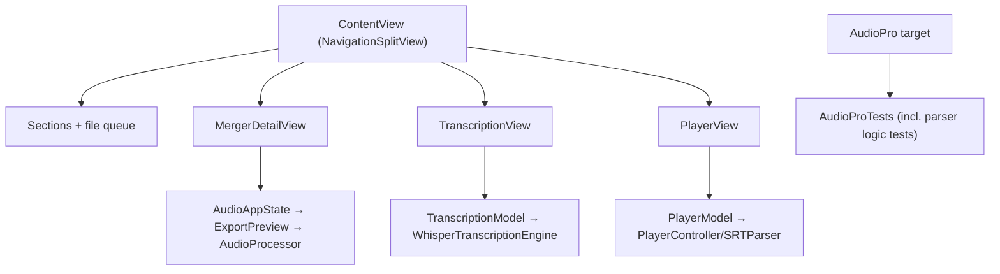
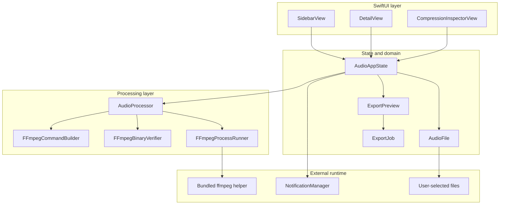
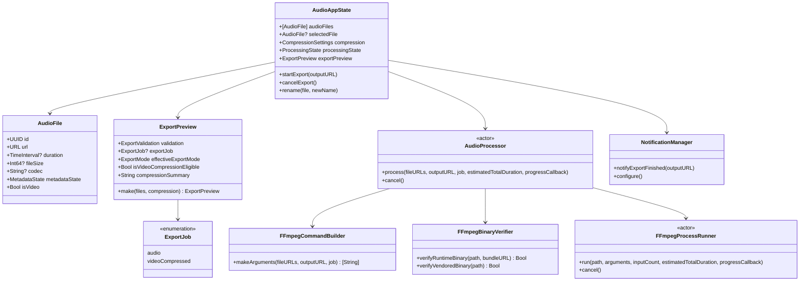
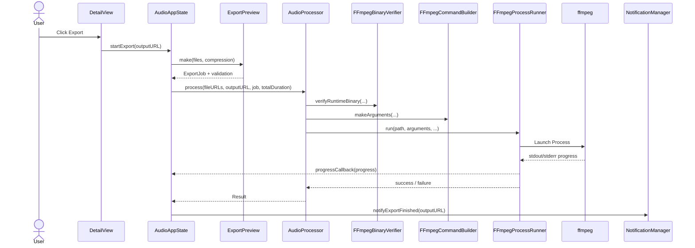
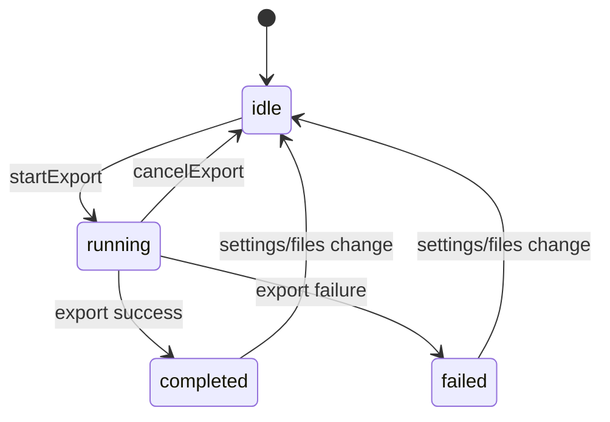
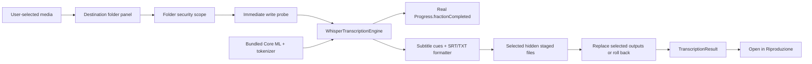
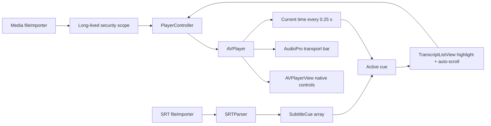

# AudioPro Architecture

The Xcode project contains one macOS application with three sidebar sections: Esportazione, Trascrizione, and Riproduzione. `AppSession` owns the three root models and coordinates explicit handoffs without coupling the ffmpeg, WhisperKit, and AVPlayer layers.

```mermaid
flowchart TD
    CV["ContentView (NavigationSplitView)"] --> Sidebar["Sections + file queue"]
    CV --> Merger["MergerDetailView"]
    CV --> Transcription["TranscriptionView"]
    CV --> Player["PlayerView"]
    Merger --> State["AudioAppState → ExportPreview → AudioProcessor"]
    Transcription --> TM["TranscriptionModel → WhisperTranscriptionEngine"]
    Player --> PM["PlayerModel → PlayerController/SRTParser"]
    AudioPro["AudioPro target"] --> AudioTests["AudioProTests (incl. parser logic tests)"]
```

## AudioPro

AudioPro is a sandboxed macOS app built around a small set of focused layers:

- SwiftUI views render the Tahoe-style interface and route user actions.
- `AudioAppState` owns UI state, file selection, export orchestration, and progress propagation.
- `ExportPreview` derives export feasibility and the final `ExportJob`.
- `AudioProcessor` orchestrates ffmpeg resolution, command building, helper verification, and process execution.
- A bundled `ffmpeg` helper performs the actual media transformation.

## High-level component map

```mermaid
flowchart TD
    subgraph UI["SwiftUI layer"]
        Sidebar["SidebarView"]
        Detail["DetailView"]
        Inspector["CompressionInspectorView"]
    end

    subgraph State["State and domain"]
        AppState["AudioAppState"]
        Preview["ExportPreview"]
        AudioFile["AudioFile"]
        Job["ExportJob"]
    end

    subgraph Processing["Processing layer"]
        Processor["AudioProcessor"]
        Builder["FFmpegCommandBuilder"]
        Verifier["FFmpegBinaryVerifier"]
        Runner["FFmpegProcessRunner"]
    end

    subgraph Runtime["External runtime"]
        Helper["Bundled ffmpeg helper"]
        Notify["NotificationManager"]
        Files["User-selected files"]
    end

    Sidebar --> AppState
    Detail --> AppState
    Inspector --> AppState
    AppState --> AudioFile
    AppState --> Preview
    Preview --> Job
    AppState --> Processor
    AppState --> Notify
    Processor --> Builder
    Processor --> Verifier
    Processor --> Runner
    Runner --> Helper
    AudioFile --> Files
```

## Simplified UML / type relationships

```mermaid
classDiagram
    class AudioFile {
        +UUID id
        +URL url
        +TimeInterval? duration
        +Int64? fileSize
        +String? codec
        +MetadataState metadataState
        +Bool isVideo
    }

    class AudioAppState {
        +[AudioFile] audioFiles
        +AudioFile? selectedFile
        +CompressionSettings compression
        +ProcessingState processingState
        +ExportPreview exportPreview
        +startExport(outputURL)
        +cancelExport()
        +rename(file, newName)
    }

    class ExportPreview {
        +ExportValidation validation
        +ExportJob? exportJob
        +ExportMode effectiveExportMode
        +Bool isVideoCompressionEligible
        +String compressionSummary
        +make(files, compression) ExportPreview
    }

    class ExportJob {
        <<enumeration>>
        audio
        videoCompressed
    }

    class AudioProcessor {
        <<actor>>
        +process(fileURLs, outputURL, job, estimatedTotalDuration, progressCallback)
        +cancel()
    }

    class FFmpegCommandBuilder {
        +makeArguments(fileURLs, outputURL, job) [String]
    }

    class FFmpegBinaryVerifier {
        +verifyRuntimeBinary(path, bundleURL) Bool
        +verifyVendoredBinary(path) Bool
    }

    class FFmpegProcessRunner {
        <<actor>>
        +run(path, arguments, inputCount, estimatedTotalDuration, progressCallback)
        +cancel()
    }

    class NotificationManager {
        +notifyExportFinished(outputURL)
        +configure()
    }

    AudioAppState --> AudioFile
    AudioAppState --> ExportPreview
    ExportPreview --> ExportJob
    AudioAppState --> AudioProcessor
    AudioAppState --> NotificationManager
    AudioProcessor --> FFmpegCommandBuilder
    AudioProcessor --> FFmpegBinaryVerifier
    AudioProcessor --> FFmpegProcessRunner
```

## Export sequence

```mermaid
sequenceDiagram
    actor User
    participant DetailView
    participant AudioAppState
    participant ExportPreview
    participant AudioProcessor
    participant FFmpegBinaryVerifier
    participant FFmpegCommandBuilder
    participant FFmpegProcessRunner
    participant ffmpeg
    participant NotificationManager

    User->>DetailView: Click Export
    DetailView->>AudioAppState: startExport(outputURL)
    AudioAppState->>ExportPreview: make(files, compression)
    ExportPreview-->>AudioAppState: ExportJob + validation
    AudioAppState->>AudioProcessor: process(fileURLs, outputURL, job, totalDuration)
    AudioProcessor->>FFmpegBinaryVerifier: verifyRuntimeBinary(...)
    AudioProcessor->>FFmpegCommandBuilder: makeArguments(...)
    AudioProcessor->>FFmpegProcessRunner: run(path, arguments, ...)
    FFmpegProcessRunner->>ffmpeg: Launch Process
    ffmpeg-->>FFmpegProcessRunner: stdout/stderr progress
    FFmpegProcessRunner-->>AudioAppState: progressCallback(progress)
    FFmpegProcessRunner-->>AudioProcessor: success / failure
    AudioProcessor-->>AudioAppState: Result
    AudioAppState->>NotificationManager: notifyExportFinished(outputURL)
```

## Processing state machine

```mermaid
stateDiagram-v2
    [*] --> idle
    idle --> running: startExport
    running --> completed: export success
    running --> failed: export failure
    running --> idle: cancelExport
    completed --> idle: settings/files change
    failed --> idle: settings/files change
```

## Sandbox and file access notes

- The app runs with App Sandbox enabled.
- The main app entitlement grants `com.apple.security.files.user-selected.read-write`.
- Imported files can be security-scoped; `AudioFile` currently keeps that capability alive for the lifetime of the model object.
- The bundled `ffmpeg` helper inherits the sandbox and is packaged inside `AudioPro.app/Contents/Helpers/`.

## Export pipeline details

- `AudioFile` loads metadata asynchronously with AVFoundation and exposes duration, size, codec, and `isVideo`.
- `ExportPreview` is the decision layer:
  - validates the current selection,
  - computes bitrate and size estimates for audio exports,
  - resolves the effective export mode,
  - emits an `ExportJob`.
- `AudioProcessor` does not decide *what* to export; it executes a precomputed `ExportJob`.
- `FFmpegCommandBuilder` keeps argument generation deterministic and separately testable.
- `FFmpegProcessRunner` owns `Process`, progress parsing, cancellation, and bounded stderr/stdout retention through `ProcessLogTail`.

## ffmpeg helper trust model

- Two vendored helpers are stored in the repository:
  - `ffmpeg-binary-arm64`
  - `ffmpeg-binary-x86_64`
- The Xcode build phase verifies their SHA-256 values before copying them into the app bundle.
- Runtime verification accepts:
  - vendored source binaries only if the SHA-256 matches;
  - packaged helpers only if the code signature is valid.
- This is sufficient for a GitHub-distributed personal project, but it is not a substitute for notarization or a full release-signing pipeline.

## Local release pipeline

```mermaid
flowchart LR
    Code["Committed source"] --> Build["./scripts/build-release.sh"]
    Build --> ReleaseApp["Release build of AudioPro.app"]
    ReleaseApp --> Verify["Verify app and ffmpeg helper signatures"]
    Verify --> Zip["Create AudioPro-<version>-macOS.zip"]
    Zip --> Checksums["Generate SHA256SUMS.txt"]
    Checksums --> Upload["Upload assets to GitHub Releases"]
```

## Distribution constraints

- Releases are built locally on macOS, then uploaded manually to GitHub Releases.
- CI validates build and tests only; it does not publish end-user artifacts.
- Without Apple Developer notarization, end users must use the standard Gatekeeper override flow on first launch.

## Trascrizione section (Whisper layer)

`TranscriptionModel` owns one active job and survives sidebar changes through `AppSession`. It validates the bundled model, shows the normalized output name in the native destination panel, requests destination-folder access, receives real WhisperKit progress, and publishes a `TranscriptionResult`.

```mermaid
flowchart LR
    Source["User-selected media"] --> Folder["Destination folder panel"]
    Folder --> Scope["Folder security scope"]
    Scope --> Probe["Immediate write probe"]
    Probe --> Engine["WhisperTranscriptionEngine"]
    Model["Bundled Core ML + tokenizer"] --> Engine
    Engine --> Progress["Real Progress.fractionCompleted"]
    Engine --> Formatter["Subtitle cues + SRT/TXT formatter"]
    Formatter --> Stage["Selected hidden staged files"]
    Stage --> Commit["Replace selected outputs or roll back"]
    Commit --> Result["TranscriptionResult"]
    Result --> Player["Open in Riproduzione"]
```

- Cancellation combines `Task.cancel()`, WhisperKit's callback stop signal, and model unloading.
- The user selects `SRT + TXT`, `Solo SRT`, or `Solo TXT`; playback handoff requires a generated SRT.
- `/` and Finder's internal `:` date separators are normalized to `-` in the prefilled output name.
- The folder write probe runs before model loading, so an App Sandbox denial cannot waste a completed transcription.
- Partial output is never published: selected files are staged and committed as one recoverable transaction.
- Existing selected files remain untouched until transcription succeeds; unselected sibling files are not modified.
- Quitting during a job offers “Continua trascrizione” or “Interrompi ed esci”; termination waits for cleanup.

## Riproduzione section (Player layer)

The Riproduzione section (`AudioPro/Player/`) uses AVFoundation with a native AppKit `AVPlayerView` wrapped by `NSViewRepresentable` and does not execute ffmpeg or WhisperKit. The wrapper shares the same `AVPlayer` owned by `PlayerController`, enables native inline controls and full screen, and keeps AudioPro's lower transport bar available. `PlayerModel` is owned by `AppSession`, so playback and the loaded transcript survive section switches.

```mermaid
flowchart LR
    MediaPicker["Media fileImporter"] --> Scope["Long-lived security scope"]
    Scope --> Controller["PlayerController"]
    Controller --> AVPlayer["AVPlayer"]
    AVPlayer --> NativeView["AVPlayerView native controls"]
    AVPlayer --> AudioProBar["AudioPro transport bar"]
    SRTPicker["SRT fileImporter"] --> Parser["SRTParser"]
    Parser --> Cues["SubtitleCue array"]
    AVPlayer --> Time["Current time every 0.25 s"]
    Time --> Active["Active cue"]
    Cues --> Active
    Active --> List["TranscriptListView highlight + auto-scroll"]
    List --> Controller
```

- `PlayerController` owns playback state, the periodic time observer, media metadata, playback-end observation, and the active media security scope.
- SRT access is short-lived: the app opens the selected URL, reads it, and immediately releases the security scope.
- Media access remains active until another media file is selected or the controller is destroyed.
- `SRTParser` accepts UTF-8 and ISO Latin-1, normalizes line endings, preserves multiline cue text, rejects invalid cues, and sorts valid cues by start time.
- The parser and cue-lookup logic tests live in `AudioProTests` (`SRTParserTests`, `SubtitleCueLookupTests`) via `@testable import AudioPro`.
- The shared `AudioPro` scheme builds the app and runs the whole suite. CI also verifies a Release build.
